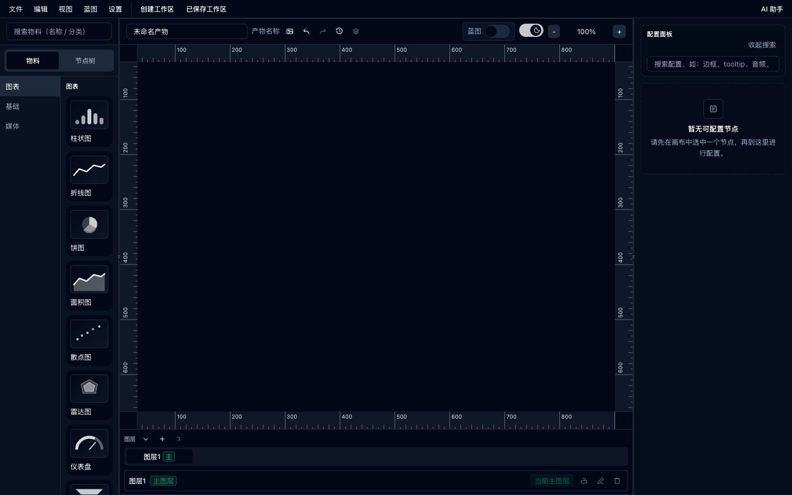
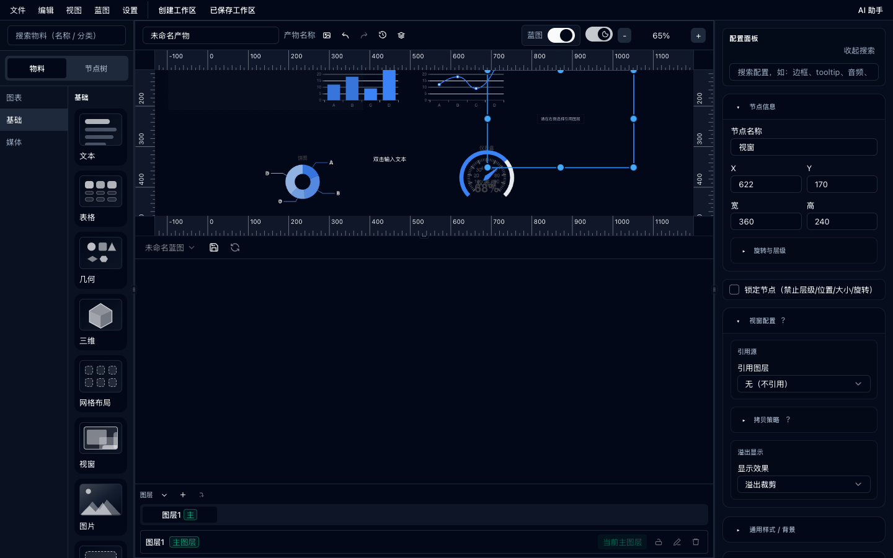
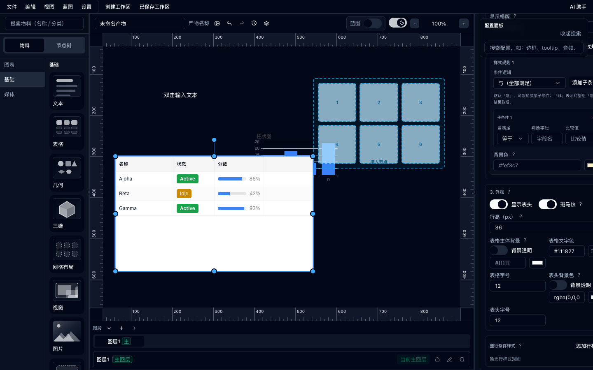
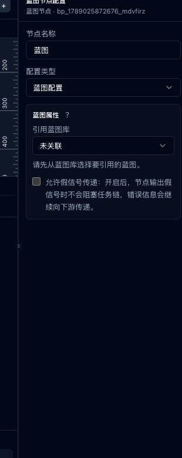
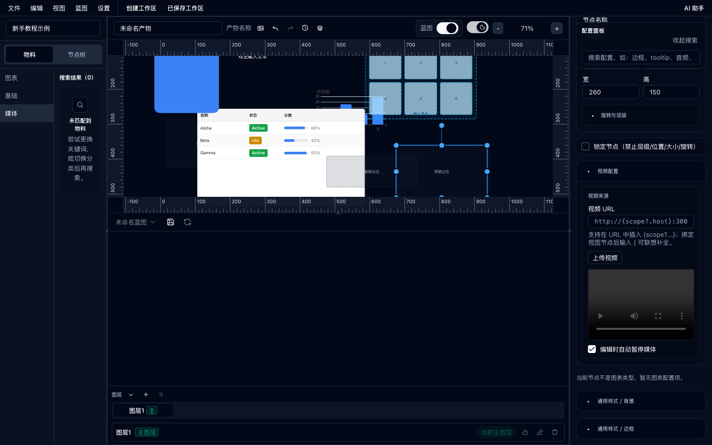

# Abuilder

面向数据大屏与业务界面的可视化低代码编辑器：在画布上拖物料，用蓝图把请求、时钟、存储和逻辑串起来，再把结果写回视图。同一套工作区数据可以本地保存、交给宿主后端，也可以切到只读预览。

提供 **React** 与 **Vue 3** 两套对齐的 UI 栈，可各自嵌入对应框架。仓库是 **pnpm + Turborepo** monorepo，核心能力拆成可独立发布的 `@arronqzy/*` 包。



## 它解决什么问题

多数图表库只负责「画出来」。Abuilder 负责编辑器本身：

- 物料拖到无限画布，改位置、大小、样式和数据绑定
- 蓝图按节点执行：页面生命周期、请求、JSON、存储、时钟、与门、子蓝图
- 节点输出进入 Scope，视图用 `{scope.xxx}` 显示，不必自己写一套刷新协议
- 工作区是一份完整文档（视图状态 + 蓝图），可进 IndexedDB，也可交给宿主保存



## 界面里能做什么

顶栏是文件、编辑、视图、蓝图、设置。左侧搜物料或看节点树，中间是带标尺的无限画布，右侧改当前选中节点，底部管图层。打开蓝图后，画布拆成上下两块，蓝图工具栏在分界线上。

| 区域 | 做什么 |
|------|--------|
| 物料 | 图表、文本、表格、几何、三维、网格、视口、图片、音视频 |
| 节点树 | 按名称搜索，定位画布上的节点 |
| 配置面板 | 按物料类型展开字段；支持搜字段名；展开状态按节点记住 |
| 图层 | 主图层、锁定、显示、合并 |
| 蓝图 | 右键加节点、连线、单步调试、执行日志、蓝图库 |
| 设置 | 亮/暗主题、中文 / English、关于里的版本号 |
| AI 助手 | 浏览器内 WebLLM，不走云端模型接口（需 WebGPU） |

物料拖上画布后，右侧配置会跟着变。表格可以配列、条件样式和 Tag：



蓝图节点选中后，侧栏会换成节点配置（名称、配置类型、引用蓝图库、假信号是否继续往下传）：



视图和蓝图可以同时开着。下面这张是上面配视频 URL（支持 `{scope?.host}`），下面画蓝图：



## 快速开始

```bash
pnpm install
```

**React 演示**（`http://127.0.0.1:31011`）：

```bash
pnpm -C apps/web dev
```

**Vue 3 演示**（`http://127.0.0.1:31012`）：

```bash
pnpm -C apps/web-vue dev
```

改 React 样式时另开两个终端监听 CSS：

```bash
pnpm -C packages/ui dev:css
pnpm -C packages/react-view dev:css
```

### 嵌进 React 应用

```bash
pnpm add @arronqzy/abuilder react react-dom
```

Vite 项目还要注册 WebLLM 插件，否则 `@mlc-ai/web-llm` 会在打包时把 `stripLiteral` 打爆栈：

```ts
import { defineConfig } from "vite";
import { webllmAssistant } from "@arronqzy/abuilder/vite";

export default defineConfig({
  plugins: [webllmAssistant()],
});
```

```tsx
import { createRoot } from "react-dom/client";
import { App } from "@arronqzy/abuilder";
import "@arronqzy/abuilder/styles.css";

createRoot(document.getElementById("root")!).render(
  <App locale="zh-CN" />
);
```

参数、工作区事件、`initialWorkspace`、预览模式见 [packages/abuilder/README.md](./packages/abuilder/README.md)。

### 嵌进 Vue 3 应用

```bash
pnpm add @arronqzy/abuilder-vue vue ant-design-vue
```

```ts
import { createApp } from "vue";
import Antd from "ant-design-vue";
import "ant-design-vue/dist/reset.css";
import { App } from "@arronqzy/abuilder-vue";

createApp(App).use(Antd).mount("#app");
```

详见 [packages/abuilder-vue/README.md](./packages/abuilder-vue/README.md)。Vue 包没有 `getPreviewSnapshot`。

### 语言

默认中文。也可读 `localStorage`（`abuilder.locale`）或浏览器语言。`<App locale="en-US" />` 固定语言；顶栏「设置」里切换会写回 localStorage。文案在 [`@arronqzy/i18n`](./packages/i18n/README.md)。

## 数据怎么流

1. 用户在画布上放图表、表格、文本。
2. 蓝图从生命周期或事件开始，经过请求 / JSON / 存储 / 时钟。
3. 执行结果写入 Scope。
4. 节点属性里的 `{scope.xxx}` 在预览和编辑预览里展开。

宿主如果要自己存工作区：订阅 `workspace:add` / `workspace:sync`，把回调里的完整 `WorkspaceData` 写到后端。打开时用 `parseWorkspaceData` 校验后再传给 `initialWorkspace`。不要直接读写编辑器内部的 IndexedDB，那是浏览器缓存，和宿主双写会打架。

## 仓库结构

```
Abuilder26/
├── apps/
│   ├── web/                 # React 演示（端口 31011）
│   └── web-vue/             # Vue 3 演示（端口 31012）
├── docs/
│   └── guide-assets/        # 本文截图
├── packages/
│   ├── abuilder/            # React 入口 <App />
│   ├── abuilder-vue/        # Vue 3 入口 <App />
│   ├── react-view/          # React 视图画布与工作区
│   ├── vue-view/            # Vue 3 视图画布
│   ├── react-blueprint/     # React 蓝图编辑器
│   ├── vue-blueprint/       # Vue 3 蓝图编辑器
│   ├── blueprint-dsl/       # 蓝图 DSL 与运行时（框架无关）
│   ├── i18n/                # 中 / 英文本
│   ├── view-table/          # 表格转换与条件样式
│   ├── view-scene3d/        # 三维场景（R3F + Three.js）
│   ├── webllm-assistant/    # 浏览器内 AI 助手
│   ├── rx-store/            # 画布状态（Immer + RxJS）
│   ├── react-rx-store/      # rx-store 的 React Hooks
│   ├── vue-rx-store/        # rx-store 的 Vue Composables
│   ├── ui/                  # React UI（Radix + Tailwind）
│   ├── tailwind/            # 共享 Tailwind 预设
│   ├── typescript-config/   # 共享 tsconfig
│   ├── eslint-config/       # 共享 ESLint
│   └── service/             # 服务层占位，尚未实现
└── pnpm-workspace.yaml
```

## 包说明

对外集成优先用 `abuilder` 或 `abuilder-vue`。下面这些包可以单独引，但多数宿主不需要。

| 包 | 说明 | 文档 |
|----|------|------|
| `@arronqzy/abuilder` | React 一站式入口 | [README](./packages/abuilder/README.md) |
| `@arronqzy/abuilder-vue` | Vue 一站式入口 | [README](./packages/abuilder-vue/README.md) |
| `@arronqzy/react-view` | 视图面板、工作区、预览 | [README](./packages/react-view/readme.md) |
| `@arronqzy/vue-view` | Vue 视图面板 | [README](./packages/vue-view/README.md) |
| `@arronqzy/react-blueprint` | 蓝图画布与调试 | [README](./packages/react-blueprint/README.md) |
| `@arronqzy/vue-blueprint` | Vue 蓝图画布 | [README](./packages/vue-blueprint/README.md) |
| `@arronqzy/blueprint-dsl` | 节点定义与图执行 | [README](./packages/blueprint-dsl/readme.md) |
| `@arronqzy/i18n` | 中英文本 | [README](./packages/i18n/README.md) |
| `@arronqzy/view-table` | 表格引擎 | [README](./packages/view-table/README.md) |
| `@arronqzy/view-scene3d` | 三维场景 | [README](./packages/view-scene3d/README.md) |
| `@arronqzy/webllm-assistant` | 离线助手运行时 | [README](./packages/webllm-assistant/README.md) |
| `@arronqzy/rx-store` | 画布状态与 Undo/Redo | [README](./packages/rx-store/readme.md) |
| `@arronqzy/react-rx-store` | React Hooks | [README](./packages/react-rx-store/README.md) |
| `@arronqzy/vue-rx-store` | Vue Composables | [README](./packages/vue-rx-store/README.md) |
| `@arronqzy/ui` | React UI 组件 | [README](./packages/ui/README.md) |
| `@arronqzy/tailwind` | Tailwind 预设（内部） | [README](./packages/tailwind/README.md) |
| `@arronqzy/typescript-config` | 共享 tsconfig | [README](./packages/typescript-config/README.md) |
| `@arronqzy/eslint-config` | 共享 ESLint | [README](./packages/eslint-config/README.md) |
| `@arronqzy/service` | 占位，勿依赖 | [README](./packages/service/README.md) |

依赖关系：

```
abuilder                         abuilder-vue
  ├── i18n                         ├── i18n
  ├── react-view                   ├── vue-view
  │     ├── ui                     │     ├── ant-design-vue
  │     ├── rx-store               │     ├── rx-store
  │     ├── react-blueprint        │     ├── vue-blueprint
  │     ├── view-table             │     ├── view-table
  │     ├── view-scene3d           │     ├── view-scene3d
  │     └── webllm-assistant       │     └── blueprint-dsl
  └── blueprint-dsl（经 view）
```

## 常用脚本

| 命令 | 说明 |
|------|------|
| `pnpm -C apps/web dev` | React 演示，端口 31011 |
| `pnpm -C apps/web-vue dev` | Vue 演示，端口 31012 |
| `pnpm build` | Turbo 构建全部可构建包 |
| `pnpm lint` | 全仓库 ESLint |
| `pnpm -C packages/abuilder build` | 构建对外发布的 React 入口 |
| `pnpm -C apps/web build` | 构建 React 演示 |

## 技术栈

共享：TypeScript、Vite、Turborepo、pnpm、RxJS、Immer、ECharts、Moveable / Selecto / Infinite Viewer。

React 栈：React 19、React Flow、Tailwind、Radix（`@arronqzy/ui`）。

Vue 栈：Vue 3、Vue Flow、Ant Design Vue。

## 发布

在 GitHub 创建 Release 后，CI 按依赖顺序发布到 npm。顺序见 [.github/workflows/publish.yml](./.github/workflows/publish.yml)。

Vue 栈以源码发布（`exports` 指向 `src/`）。React 的 `@arronqzy/abuilder` 会构建 `dist/` 和 CSS。

## 更细的说明

截图素材在 `docs/guide-assets/live-zh/`。更长的操作手册是仓库里的 Word：`docs/Abuilder使用文档与功能说明.docx`（不随 npm 包发布）。

## 许可证

核心包多为 MIT，以各包 `package.json` 为准。
